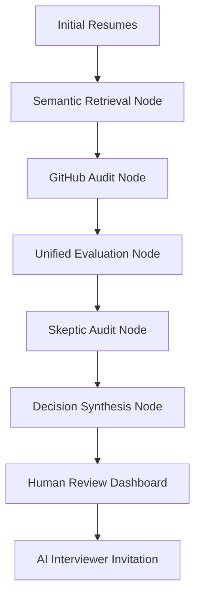

# AI Recruitment Intelligence Platform 🚀

An enterprise-grade, multi-agent recruitment pipeline designed to streamline the hiring process from candidate screening to final decision synthesis using LangGraph, Google Gemini, and LiveKit.

## 🌟 Key Features

- **Multi-Agent Screening**: Orchestrates specialized AI agents (Screening, Skeptic, Synthesizer) to evaluate candidates.
- **Semantic Search**: leverages FAISS vector embeddings to match resumes with Job Descriptions.
- **GitHub Audit**: Automatically verifies technical competence by analyzing public repository metadata and code quality.
- **AI-Driven Interviews**: Real-time AI interviewer using LiveKit for voice/video interaction and candidate assessment.
- **Decision Synthesis**: Aggregates multi-agent insights into a final, human-in-the-loop hiring recommendation.
- **Proactive Risk Detection**: Adopts an adversarial "Skeptic" agent to identify potential red flags and skill gaps.

## 🏗️ Architecture



## 🚀 Quick Start

### Backend Setup
1. **Environment**:
   ```bash
   cd backend
   python -m venv venv
   source venv/bin/activate  # venv\Scripts\activate on Windows
   pip install -r requirements.txt
   ```
2. **Configuration**: Create a `.env` file in the `backend` directory based on the provided requirements (Google API Key, LiveKit credentials, etc.).
3. **Run**:
   ```bash
   uvicorn app.main:app --reload
   ```

### Frontend Setup
1. **Install Dependencies**:
   ```bash
   cd frontend
   npm install
   ```
2. **Run Dev Server**:
   ```bash
   npm run dev
   ```

## 🛠️ Tech Stack

- **Backend**: FastAPI, LangGraph, LangChain, Google Gemini API, FAISS, SQLAlchemy.
- **Frontend**: React (Vite), TailwindCSS, Lucide Icons, LiveKit Components.
- **Agents**: Custom Agentic AI implementations for adversarial audit and synthesis.

## 📄 License
MIT License - Developed for Advanced AI Recruitment Pipelines.
